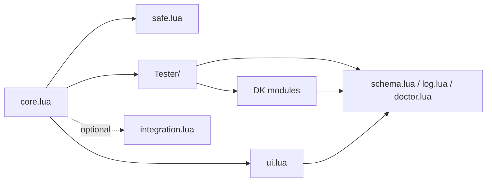

# Code graph

```mermaid
flowchart LR
  Boot[core.lua] --> Safe[safe.lua]
  Boot --> Tester[Tester/]
  Tester --> Modules[DK modules]
  Tester --> Data[schema.lua / log.lua / doctor.lua]
  Modules --> Data
  Boot --> UI[ui.lua]
  UI --> Data
  Boot -. optional .-> Integrations[integration.lua]
```

The graph describes repository-local control and data relationships; optional load-on-demand addons are excluded.
